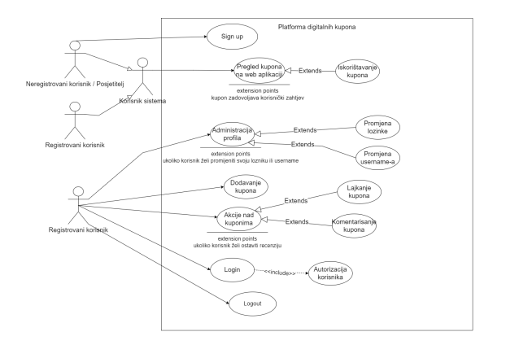

# **2. General description**

## **2.1 Product perspective**

bbKupons represents the improvement of the classic way of advertising and sharing coupons, which everyone already knows
well known. As we know, one of the most popular mechanisms that can enable significant
savings are coupons. Coupons in addition to being a good and proven way to prove that a certain amount
money paid, also, from the business side, is one of the proven ways to advertise and
"acquiring" new clients. Today, we can increasingly see the disadvantages of physical documents,
also coupons are no exception to this category. We can recognize the shortcomings through situations such as
are: loss of the coupon, destruction of the physical copy, falsification of the copy. Disadvantages we can
viewed through economic or ecological aspects. bbThe coupon system, as an idea, is based on
mentioned shortcomings and provides a solution for two types of users.

In the next use case diagram, we will show the concept of the project and the interaction of the registered i
unregistered user with the system:

<figure markdown>
  { width="700" }
  <figcaption>Use case diagram</figcaption>
</figure>

## **2.2 Product Features**

| Product Features   | Description                                                                                                          |
|--------------------|----------------------------------------------------------------------------------------------------------------------|
| FP-1               | The system must provide an overview of all coupons on the page, regardless of whether the user is registered or not. |
| FP-2               | The user should be able to publish the coupon only if he is authenticated and authorized.                            |
| FP-3               | The user should be able to like and leave a comment on individual coupons if he is authenticated and authorized.     |
| FP-4               | The user should be able to filter coupons by name.                                                                   |
| FP-5               | The user should be able to filter coupons by specific categories.                                                    |

## **2.3 Klase korisnika i karakteristike**

Korisnici sistema podijeljeni su u dvije kategorije: registrovani korisnici i posjetitelji. Posjetitelji
imaju minimalne mogućnosti, koje se ogledaju kroz pregled dostupnih kupona. S druge strane,
registrovani korisnici imaju dodatne mogućnosti kao što su: dodavanje kupona, like-ovanje i
komentarisanje dostupnih kupona. Kategorije korisnika i njihove mogućnosti su opisane u nastavku.

### ***2.3.1 Class registered user***

^^Brief description^^: The user accesses the web application, reviews coupons, adds a new coupon, performs
"liking" and commenting on existing coupons.

Step by step description:

1. The user accesses the web application
2. Loading the web application (the system displays the available coupons on the home page)
3. The user logs in to the page using the credentials he used on the occasion
registration
4. The system recognizes the user as a registered user and assigns him permissions
for additional functionalities
5. The registered user starts the process of creating a new coupon
6. The system opens a form to the registered user that needs to be filled in with the relevant information
data related to the coupon.
7. The registered user by clicking on "Submit" starts the coupon publishing process
to users.
8. After publishing a new coupon, the system redirects the user to the initial one
page with a list of all available coupons.
9. The registered user accesses each individual coupon, whereby he
enabled to perform their "liking", commenting and detailed review
information.

### ***2.3.2 Class visitor/unregistered user***

^^Short description^^: The visitor accesses the web application, reviews the coupon, downloads the activation
coupon code, visits the service/product provider's page.

Step by step description:

1. The visitor accesses the web application
2. Loading the web application
3. The visitor reviews the available coupons
4. The visitor selects a coupon
5. The system opens detailed information about the selected coupon to the visitor
6. The visitor downloads/copies the activation code of the coupon
7. The visitor visits the page of the service/product provider that is available in the description
of the coupon found in the detailed information of the selected coupon

## **2.4 Operating Environment**

| Work environment   | Description                                                                                                                     |
|--------------------|---------------------------------------------------------------------------------------------------------------------------------|
| RO-1               | The system will work on computers, laptops, smartphones and all other devices that have the ability to run one of the browsers. |
| RO-2               | The system should work on all new versions of the web browser.                                                                  |
| RO-3               | The system should be independent of the operating system of the machine it is running on, since it is a web application.        |
| RO-4               | The system should be independent of the geographical area of the user and the time of use.                                      |

## **2.5 Design and Implementation Constraints**

N/A. There are currently no design and implementation limitations.

## **2.6 User Documentation**

N/A. There is currently no user documentation. When creating a software solution, it will be accessed
creation of user documentation.

## **2.7 Assumptions and dependencies**

| Assumptions and dependencies  | Description                                |
|-------------------------------|--------------------------------------------|
| PZ-1                          | Users have access to the Internet.         |
| PZ-2                          | Users have a newer version of the browser. |