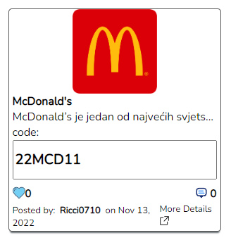

# **3. External Interfaces Requirements Specification**

## **3.1 User Interface**

| User interface   | Description                                                                                                                                  |
|------------------|----------------------------------------------------------------------------------------------------------------------------------------------|
| KI-1             | When accessing the site, the visitor will be shown the home page.                                                                            |
| KI-2             | System navigation will be enabled through the home page.                                                                                     |
| KI-3             | The navigation bar will allow you to move from page to page.                                                                                 |
| KI-4             | Using the home page, it will be possible to view the available coupons.                                                                      |
| KI-5             | By clicking on "More Details" on an individual coupon, a detailed overview of the coupon's characteristics will be enabled.                  |
| KI-6             | Clicking on the site logo will enable you to return to the home page.                                                                        |
| KI-7             | By clicking on "Login" registration will be enabled for registered users.                                                                    |
| KI-8             | By clicking on "Sign up", visitors will be able to register.                                                                                 |
| KI-9             | By clicking on "Add" it will be possible to add a new coupon with all the necessary parameters.                                              |
| KI-10            | By clicking on "Account" it will be possible to change the details of the user account (username and password).                              |
| KI-11            | By clicking on the "Heart" icon on an individual coupon, it will be possible to like that coupon.                                            |
| KI-12            | By entering the text in the provided field and clicking on the "Comment" button, it will be possible to post comments on individual coupons. |
| KI-13            | By clicking on "LogOut" you will be able to log out of the user account.                                                                     |
| KI-14            | Clicking on "About" will display detailed information about the platform itself.                                                             |

<figure markdown>
   { width="300" }
   <figcaption>Coupon layout on the page</figcaption>
</figure>

## **3.2 Hardware Interface**

| Hardware interface   | Description                                                                                                                       |
|----------------------|-----------------------------------------------------------------------------------------------------------------------------------|
| HI-1                 | The system will be supported by computers, laptops, smartphones and all other devices that have the ability to run a web browser. |

## **3.3 Software Interface**

| Software interface   | Description                                                                                                                                                                                                                                                            |
|----------------------|------------------------------------------------------------------------------------------------------------------------------------------------------------------------------------------------------------------------------------------------------------------------|
| SI-1                 | The software depends on the MongoDB database, which is created as a cluster in the cloud and will be used to execute various queries.                                                                                                                                  |
| SI-2                 | The software on the server side depends on the following libraries: bcrypt, cors, dotenv, express, joi, jsonwebtoken, mongoose, nodemon.                                                                                                                               |
| SI-3                 | The software on the client side depends on the following libraries: @testing-library/jestdom, @testing-library/react, @testing-library/user-event, axios, moment, momentjs, react, react-dom, react-router-dom, react-scripts, react-spinners, router-dom, web-vitals. |

## **3.4 Communication interface**

The HTTPS protocol should be used as the communication interface between the client and server side.